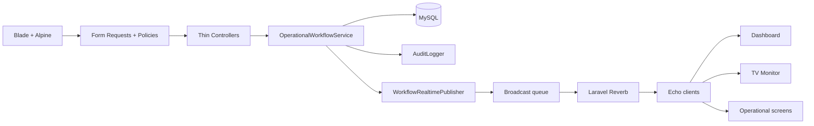

# Architecture

`OperationalWorkflowService` is the sole writer for the final four-stage workflow. It locks the participant row before validating and applying a transition. `DonationCapacityService` locks one `event_donation_capacity_lanes` row for the participant gender before entering or leaving `donating`; the two capacity fields in `event_settings` remain the configuration source of truth. This prevents overbooking for the same gender without serializing male and female operations. `QueueNumberGenerator` owns smallest-available number allocation. Controllers only select a screen or delegate an action. The active-event capacity endpoint requires the `event.update_donation_capacity` permission and records an audit before publishing snapshots. Public operational endpoints are limited to the active event by scoped binding and `operational.event`, then protected by CSRF, rate limiting, transactions, locks, and transition validation.

`EventQueueResetService` adalah satu-satunya writer untuk reset operasional administratif. Ia memperoleh exclusive event lock, menghapus hanya data berscope event di dalam transaksi, menulis audit immutable `queue.reset`, lalu meminta `WorkflowRealtimePublisher` menerbitkan tiga snapshot. Mutasi workflow donor memakai shared event lock sebelum lock peserta/lane sehingga reset tidak dapat berinterleaving, namun operasi donor laki-laki dan perempuan tetap paralel pada lock kapasitas per gender.

Legacy service-post classes remain as compatibility adapters for historical records and integrations. They are not part of panitia navigation or the active operational workflow.
