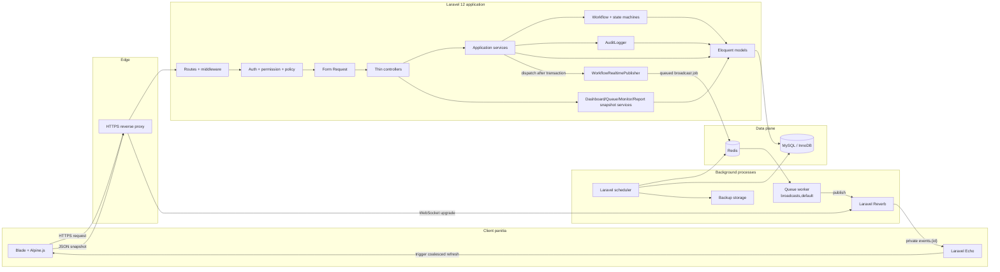
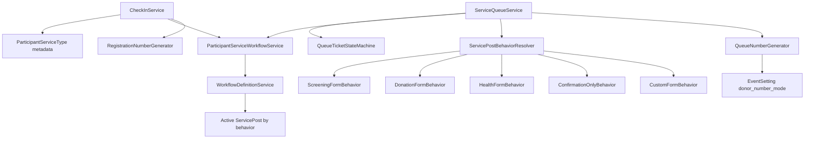

# Architecture Diagram

SEHAT-APP memakai arsitektur Laravel berlapis dengan workflow service-aware, transaksi database, dan event realtime setelah commit.

## Container dan aliran data



## Tanggung jawab layer

| Layer | Tanggung jawab |
| --- | --- |
| Route/middleware | Authentication, permission middleware, rate limiting, scoped route model binding |
| Form Request | Authorization awal dan validasi input |
| Policy | Otorisasi model/event/tiket |
| Controller | Orkestrasi HTTP, redirect, response JSON/View |
| Application service | Business transaction, row locking, audit, dan pemanggilan workflow |
| Workflow service | Routing berdasarkan layanan, behavior pos, dan hasil kelayakan |
| State machine | Validasi transisi status peserta dan tiket |
| Eloquent/model | Mapping schema, relationship, cast enum/timestamp |
| Snapshot service | Query dashboard, antrean, monitor, dan report tanpa menaruh business mutation di controller |
| Realtime publisher | Menerjemahkan perubahan domain menjadi event canonical dan invalidasi snapshot |

## Komponen workflow



Routing SOP baru memakai `ParticipantServiceType` dan `ServicePostBehavior`. Nama serta kode pos adalah data presentasi. `sequence` hanya memilih pos pertama ketika ada beberapa pos dengan behavior sama dan mendukung fallback data legacy.

`QueueNumberGenerator::nextDonor()` adalah satu-satunya pengambil keputusan lane nomor donor. Ia menerima event dan gender peserta, membaca mode nomor dari pengaturan event yang dikunci, kemudian menghasilkan alokasi `{queueType, number}`. Dengan demikian workflow canonical dan adapter legacy tidak dapat memilih mode antrean secara terpisah.

## Batas transaksi

Mutation workflow dijalankan di dalam database transaction:

1. Event dan record operasional terkait dikunci dengan `lockForUpdate`.
2. State machine memvalidasi transisi.
3. Nomor aktif terkecil dicari pada scope yang tepat.
4. Peserta, layanan, tiket, hasil form, dan audit disimpan.
5. Setelah commit, event broadcast dimasukkan ke queue `broadcasts`.

`afterCommit=true` mencegah client menerima update yang belum committed. Unique constraint tetap diperlukan untuk melindungi dari kesalahan aplikasi atau transaksi bersamaan.

## Arsitektur realtime

Semua event canonical dikirim ke private channel `events.{eventId}`.

### Event domain

| Broadcast name | Makna |
| --- | --- |
| `participant.registered` | Registrasi berhasil |
| `participant.moved-to-eligibility` | Peserta masuk antrean kelayakan |
| `participant.eligible` | Peserta dinyatakan layak |
| `participant.ineligible` | Peserta dinyatakan tidak layak |
| `participant.moved-to-donation` | Nomor donor dibuat dan peserta masuk antrean donor |
| `participant.donation-completed` | Pelayanan donor selesai |
| `participant.moved-to-health-check` | Peserta masuk antrean pemeriksaan kesehatan |
| `participant.health-check-completed` | Pemeriksaan kesehatan selesai |

Payload standar event domain:

```json
{
  "event_id": 1,
  "event_participant_id": 10,
  "queue_ticket_id": 25,
  "next_service_post_id": 3
}
```

### Event invalidasi snapshot

| Broadcast name | Consumer utama |
| --- | --- |
| `queue.updated` | Antrean registrasi dan antrean pelayanan |
| `dashboard.updated` | Dashboard dan report |
| `tv-monitor.updated` | TV Monitor |

Payload invalidasi memuat `event_id`, `reason`, `event_participant_id`, `queue_ticket_id`, dan `service_post_id`. Client tidak memperlakukan payload sebagai snapshot final; client mengambil ulang endpoint JSON yang diotorisasi.

Event lama seperti `participant.checked-in`, `service.queue.updated`, `health.queue.updated`, `donor.queue.updated`, dan `screening.updated` tetap disiarkan/didengar untuk kompatibilitas layar serta integrasi yang sudah ada. Event canonical adalah kontrak utama untuk pengembangan baru.

## Reliability realtime

- Broadcast memakai queue `broadcasts`, bukan dieksekusi di request utama.
- Worker production harus mendahulukan queue `broadcasts` sebelum `default`.
- Reverb hanya menerima origin yang dikonfigurasi.
- Channel authorization memeriksa permission dan assignment operator.
- Echo memilih hanya transport `ws` untuk HTTP atau `wss` untuk HTTPS.
- Refresh client dikoaleskan: broadcast yang tiba saat fetch berjalan menjadwalkan satu refresh lanjutan.
- Saat koneksi kembali `connected`, client melakukan refresh snapshot sehingga tidak tertinggal selama disconnect.

## Security boundary

- Semua layar operasional berada di middleware `auth`.
- Permission Spatie membatasi menu dan route.
- Policy memvalidasi akses ke Event, peserta, tiket, laporan, dan monitor.
- CSRF berlaku untuk seluruh mutation web.
- Blade melakukan escaping secara default.
- Security headers dan CSP diterapkan melalui middleware.
- Rate limiter terpisah digunakan untuk operasi, report, dan readiness.
