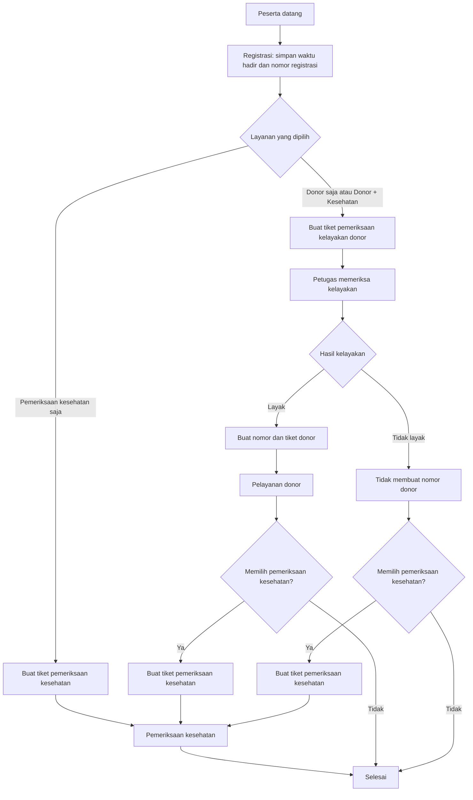
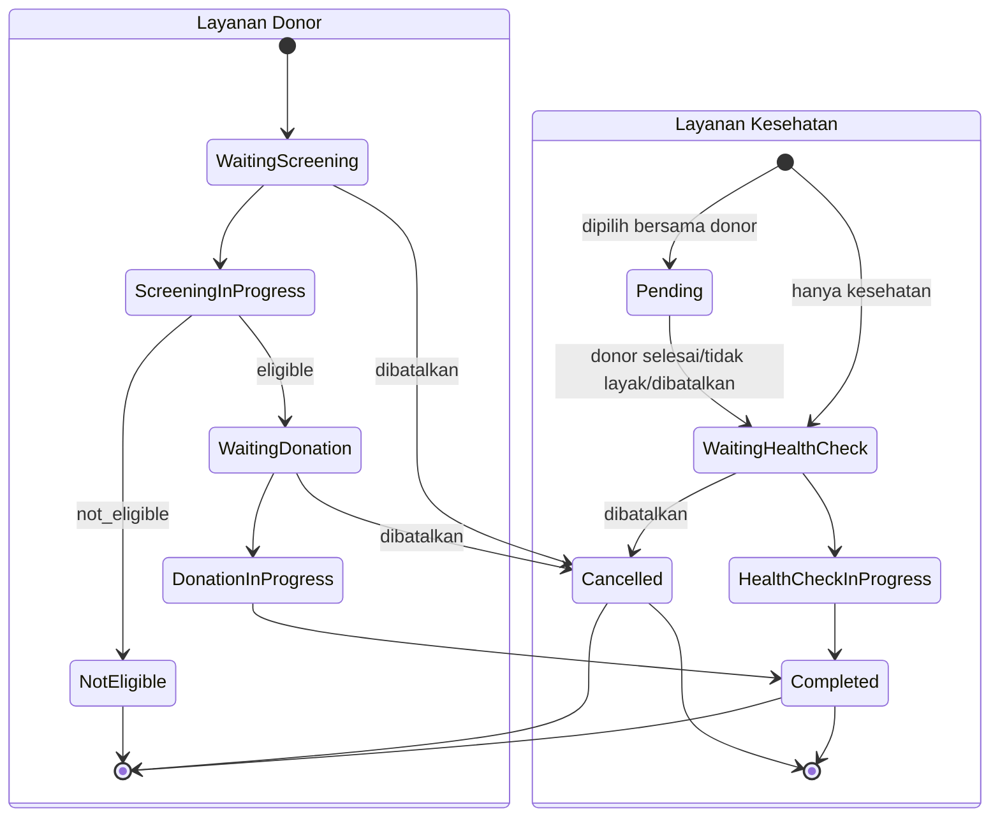

# Final Business Workflow

Dokumen ini adalah sumber kebenaran workflow operasional SEHAT-APP. Routing peserta mengikuti layanan yang dipilih dan hasil kelayakan donor. Urutan `service_posts.sequence` tidak menentukan cabang bisnis utama.

## Layanan

Layanan peserta disimpan pada `event_participant_services`. Implementasi saat ini menyediakan:

| Nilai enum | Label | Titik masuk |
| --- | --- | --- |
| `donor` | Donor Darah | Pos aktif dengan behavior `screening_form` |
| `health_check` | Pemeriksaan Kesehatan | Pos aktif dengan behavior `health_form` |

UI registrasi membaca `ParticipantServiceType::cases()`. Metadata enum menentukan label, deskripsi, prioritas registrasi, behavior titik masuk, dan status awal. Penambahan layanan baru harus disertai definisi enum, strategi transisi, constraint migration, behavior/form yang diperlukan, serta test end-to-end.

## Diagram workflow

## Aturan registrasi

1. Event harus aktif. Aktivasi event ditolak sampai tersedia pos aktif `screening_form`, `donation_form`, dan `health_form`.
2. Peserta harus memilih minimal satu layanan.
3. Pos titik masuk layanan yang dipilih harus tetap aktif saat check-in: `screening_form` untuk donor atau `health_form` untuk kesehatan saja.
4. Pos downstream juga harus aktif ketika transisi membutuhkannya: `donation_form` setelah peserta dinyatakan layak dan `health_form` setelah donor/tidak layak jika kesehatan juga dipilih.
5. Check-in menyimpan `checked_in_at`, petugas registrasi, nomor registrasi, posisi awal, serta satu baris per layanan yang dipilih.
6. Check-in idempotent: peserta yang sudah check-in pada event yang sama memperoleh kembali data registrasi yang sudah ada.
7. Peserta dengan registrasi yang telah dibatalkan tidak dibuat ulang secara diam-diam; histori pembatalan tetap dipertahankan.

## Nomor registrasi

`registration_number` adalah angka urut global di dalam satu event. Laki-laki dan perempuan memakai urutan numerik yang sama.

Format tampilan dikonfigurasi melalui `registration_number_format`:

- `gender_prefix`: prefix mengikuti gender. Contoh urutan global: `L001`, `P002`, `L003`, `P004`.
- `uniform`: semua peserta memakai `registration_queue_prefix`, misalnya `R001`, `R002`.

Generator mencari angka aktif terkecil yang kosong, bukan menggunakan `AUTO_INCREMENT`. `active_registration_number` melindungi keunikan angka yang masih aktif. Ketika registrasi dibatalkan, nilai aktif dikosongkan sehingga angka dapat digunakan kembali tanpa menghapus `registration_number` historis.

## Nomor donor

Nomor donor hanya diterbitkan setelah hasil screening `eligible`.

`donor_number_mode` pada pengaturan event menentukan lane:

- `global`: satu urutan `donor_global`, biasanya ditampilkan sebagai `D001`, `D002`, dan seterusnya.
- `gender_separated`: lane `male_donor` dan `female_donor` terpisah, masing-masing memakai prefix laki-laki/perempuan.

`QueueNumberGenerator::nextDonor()` menerima `Event` dan gender peserta, lalu membaca `donor_number_mode` dari `EventSetting` yang dikunci. Mode tersebut menentukan lane sebelum generator membaca seluruh `active_number` pada scope terkait, mengurutkan angka, lalu memilih angka positif terkecil yang belum dipakai. Seluruh jalur penerbitan nomor donor, termasuk kompatibilitas workflow legacy, memakai entry point yang sama. Constraint unik `(event_id, number_scope, active_number)` menjadi pertahanan terakhir terhadap duplikasi.

Scope nomor:

- antrean donor: `lane:donor_global`, `lane:male_donor`, atau `lane:female_donor`;
- antrean pelayanan lain: `post:{service_post_id}`.

## State layanan peserta

State donor dan pemeriksaan kesehatan disimpan terpisah agar pilihan ganda tidak saling menimpa.

`event_participants.status` adalah ringkasan posisi peserta untuk query operasional dan kompatibilitas. Sumber kebenaran pilihan serta progres tiap layanan adalah `event_participant_services`.

## Timestamp

| Aktivitas | Kolom |
| --- | --- |
| Registrasi | `event_participants.checked_in_at` |
| Mulai kelayakan | `event_participant_services.eligibility_started_at` pada layanan donor |
| Selesai kelayakan | `event_participant_services.eligibility_completed_at` |
| Mulai donor | `event_participant_services.started_at` pada layanan donor |
| Selesai donor | `event_participant_services.completed_at` pada layanan donor |
| Mulai pemeriksaan kesehatan | `event_participant_services.started_at` pada layanan kesehatan |
| Selesai pemeriksaan kesehatan | `event_participant_services.completed_at` pada layanan kesehatan |
| Seluruh alur selesai | `event_participants.completed_at` |
| Panggil/mulai/selesai tiket | `queue_tickets.called_at`, `served_at`, `finished_at` |
| Pembatalan | `cancelled_at` dan `cancelled_by` pada registrasi/tiket terkait |

## Pembatalan

- Pembatalan registrasi membatalkan tiket aktif, menandai layanan sebagai `cancelled`, mengosongkan nomor aktif, dan mempertahankan histori.
- Tiket yang sedang `serving` tidak dapat dibatalkan dari meja registrasi.
- Jika proses donor dibatalkan tetapi peserta juga memilih pemeriksaan kesehatan yang masih `pending`, peserta diteruskan ke pemeriksaan kesehatan.
- Nomor yang dilepas dapat dipakai kembali oleh peserta berikutnya.

## Pos Pelayanan

Routing final mencari pos aktif berdasarkan `ServicePostBehavior`, bukan nama, kode, atau tipe legacy:

| Behavior | Peran pada SOP |
| --- | --- |
| `screening_form` | Pemeriksaan kelayakan donor |
| `donation_form` | Pelayanan donor |
| `health_form` | Pemeriksaan kesehatan |
| `confirmation_only` | Kompatibilitas/generic completion |
| `custom_form` | Kompatibilitas/form catatan tambahan |

Jika terdapat lebih dari satu pos aktif dengan behavior yang sama, `sequence` menentukan pos pertama yang dipakai untuk behavior tersebut. Alur berbasis “pos aktif berikutnya” hanya dipertahankan sebagai fallback bagi data legacy yang belum mempunyai pilihan layanan; bukan aturan SOP baru.

### Konfirmasi pemeriksaan kesehatan

Behavior `health_form` pada workflow aktif adalah konfirmasi bahwa layanan kesehatan telah diberikan. UI petugas hanya menampilkan identitas peserta dan aksi **Selesaikan Pemeriksaan**; tidak ada kewajiban mengisi tekanan darah, HB, antropometri, diagnosis, catatan, atau data medis lain. Aksi tersebut tetap menjalankan transaksi penyelesaian yang sama, menyimpan timestamp layanan, memperbarui status peserta, dan menerbitkan broadcast canonical serta snapshot.

Kolom hasil kesehatan lama dan payload API tetap diterima secara nullable demi backward compatibility. Keduanya bukan prasyarat penyelesaian layanan dan tidak mengubah routing peserta.

## Realtime

Setiap perubahan workflow menerbitkan event canonical pada private channel `events.{eventId}`. Event domain menjelaskan apa yang terjadi, sedangkan event snapshot meminta consumer memperbarui data:

- `participant.registered`
- `participant.moved-to-eligibility`
- `participant.eligible`
- `participant.ineligible`
- `participant.moved-to-donation`
- `participant.donation-completed`
- `participant.moved-to-health-check`
- `participant.health-check-completed`
- `queue.updated`
- `dashboard.updated`
- `tv-monitor.updated`

Broadcast berjalan setelah transaksi commit melalui queue `broadcasts`. Echo menerima notifikasi lalu mengambil snapshot JSON terbaru. Refresh yang datang bersamaan dikoaleskan dan client melakukan refresh ulang setelah koneksi Reverb tersambung kembali.
