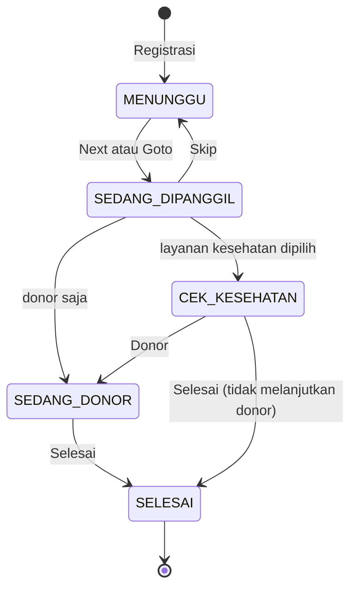

# Workflow Operasional Final

Dokumen ini adalah sumber kebenaran workflow aktif.

## Aturan

1. Status operasional adalah `waiting`, `calling`, `health_check`, `donating`, dan `finished`. `calling` berarti nomor sedang dipanggil oleh Screen Petugas; bukan layanan medis tambahan.
2. Semua daftar diurutkan `registration_number ASC, id ASC`; nomor terkecil selalu di atas.
3. Registrasi menyimpan `checked_in_at`, memilih minimal satu layanan, dan membuat nomor registrasi global dengan angka aktif terkecil yang kosong.
4. Aksi Next, Goto, Skip, Cek Kesehatan, Donor, dan Selesai berjalan dalam transaksi dengan `lockForUpdate`, validasi status sumber, history, audit, dan broadcast setelah commit.
5. Permintaan kedua setelah status sudah berubah menerima validasi jelas dan tidak membuat transisi atau nomor baru.
6. Peserta kesehatan-saja dapat diselesaikan dari Cek Kesehatan. Peserta yang memilih donor juga dapat diselesaikan dari Cek Kesehatan bila tidak melanjutkan donor; layanan donornya dicatat sebagai dibatalkan secara internal tanpa menampilkan keputusan medis pada UI.
7. Peserta yang berubah tahap hanya dihapus dari daftar tahap sebelumnya. Sampai `finished`, posisi terkininya tetap tersedia pada Screen Petugas, Dashboard, dan TV Monitor.

## Area kerja panitia

| Bagian pada Screen Petugas | Peserta yang tampil | Aksi yang tersedia |
| --- | --- | --- |
| Antrean berikutnya | `waiting`, dipisah gender dan diurutkan nomor | Next, Skip, Goto mengubah `waiting` menjadi `calling` atau sebaliknya |
| Sedang dipanggil | `calling` | Peserta donor-saja menuju Donor; peserta yang memilih kesehatan menuju Cek Kesehatan |
| Cek Kesehatan | `health_check` | Donor -> `donating`, atau Selesai -> `finished` |
| Sedang Donor | `donating` | Selesai -> `finished` |
| Selesai | `finished` | Read-only |

Semua area tersebut berada pada satu Screen Petugas. URL tahap lama hanya meneruskan ke layar ini untuk kompatibilitas bookmark. Screen Petugas memiliki kontrol panggilan per gender dan daftar posisi peserta aktif. Ketika peserta berpindah tahap, ia hilang hanya dari tahap sebelumnya lalu langsung tampil pada tahap barunya sampai status `finished`.

## Nomor donor

Nomor donor **selalu sama dengan nomor registrasi**. `QueueNumberGenerator` hanya mengalokasikan nomor registrasi; aksi Donor membuat tiket lifecycle yang mereferensikan nomor tersebut, bukan nomor kedua.

| Registrasi | Nomor pada Cek Kesehatan / Donor / TV / Dashboard |
| --- | --- |
| `L-021` | `L-021` |
| `P-021` | `P-021` |

Tiket donor memakai lane internal gender (`male_donor` atau `female_donor`) hanya untuk keamanan indeks database dan kapasitas. Lane tersebut tidak membuat urutan `D-001` baru. Field mode/prefix donor lama tetap disimpan untuk membaca data historis dan kompatibilitas API, namun tidak menentukan nomor proses operasional baru.

## Kapasitas donor paralel

`event_settings.donation_capacity_male` dan `event_settings.donation_capacity_female` menentukan maksimum peserta `donating` untuk masing-masing gender. Keduanya default `4` dan independen: 4/4 laki-laki tidak membatasi 2/4 perempuan. Kolom lama `donation_capacity` dipertahankan hanya untuk baca kompatibilitas dan tidak dipakai business logic.

Saat aksi **Donor**, `OperationalWorkflowService` mengunci peserta dan satu baris mutex `event_donation_capacity_lanes` sesuai gender. `DonationCapacityService` kemudian menghitung donor aktif pada gender tersebut dan menolak hanya lane yang penuh. Dua aksi pada peserta/gender yang sama aman terhadap klik ganda; aksi laki-laki dan perempuan tidak menunggu lock kapasitas satu sama lain. Peserta yang ditolak tetap berada di Cek Kesehatan dan dapat dicoba lagi setelah donor pada gender yang sama selesai.

Petugas dengan permission `event.update_donation_capacity` dapat mengubah dua kapasitas pada event aktif. Penurunan yang lebih kecil dari donor aktif ditolak, setiap perubahan dicatat sebagai audit `donation_capacity.updated`, dan `queue.updated`, `dashboard.updated`, serta `tv-monitor.updated` diterbitkan agar semua layar memuat snapshot baru tanpa reload.

## Reset antrean event

Reset adalah utilitas administratif pasca-UAT, bukan penghapusan event atau master peserta. Aksi `POST /events/{event}/queue-reset` memerlukan permission `event.reset_queue`, CSRF, dan kata konfirmasi persis `RESET`. Seluruh operasi berjalan dalam satu transaksi dan exclusive event lock: tiket antrean, registrasi event, layanan peserta, riwayat status, hasil proses lama, serta submission pos pada event tersebut dihapus; pengaturan event dan kapasitas gender tetap ada.

`audit_logs` tidak dihapus karena merupakan jejak immutable. Setiap reset menambahkan audit `queue.reset` dengan actor, waktu, jumlah tiket/peserta/riwayat yang dihapus, dan jumlah donor aktif saat reset. Bila antrean telah kosong, aksi aman diulang dan mengembalikan pesan `Antrean event sudah kosong.`. Reset yang benar-benar menghapus data menerbitkan `queue.updated`, `dashboard.updated`, dan `tv-monitor.updated`, sehingga semua layar memuat state kosong tanpa reload. Karena generator membaca nomor aktif yang tersisa, registrasi serta nomor donor berikutnya kembali dimulai dari nomor pertama pada prefix/mode event.

## Layanan dan status

`event_participant_services` menyimpan layanan yang dipilih (`donor`, `health_check`). `event_participants.status` menyimpan posisi operasional. Keduanya tidak saling menggantikan.

## Realtime

Setiap perubahan menerbitkan event domain dan snapshot pada public event channel `events.{eventId}`: `participant.registered`, `participant.moved-to-health-check`, `participant.moved-to-donation`, `participant.donation-completed` atau `participant.health-check-completed`, `queue.updated`, `dashboard.updated`, dan `tv-monitor.updated`. NEXT, GOTO, dan SKIP juga menerbitkan `queue.updated`, sehingga status `calling`, posisi aktif, Dashboard, TV Monitor, dan Screen Petugas tersinkron tanpa reload. Kanal ini diperlukan karena layar panitia dan TV Monitor tidak memakai login; endpoint HTTP-nya tetap dibatasi ke event aktif dan semua mutation tetap melewati CSRF, rate limit, scoped binding, transaction, lock, serta validasi transisi.
