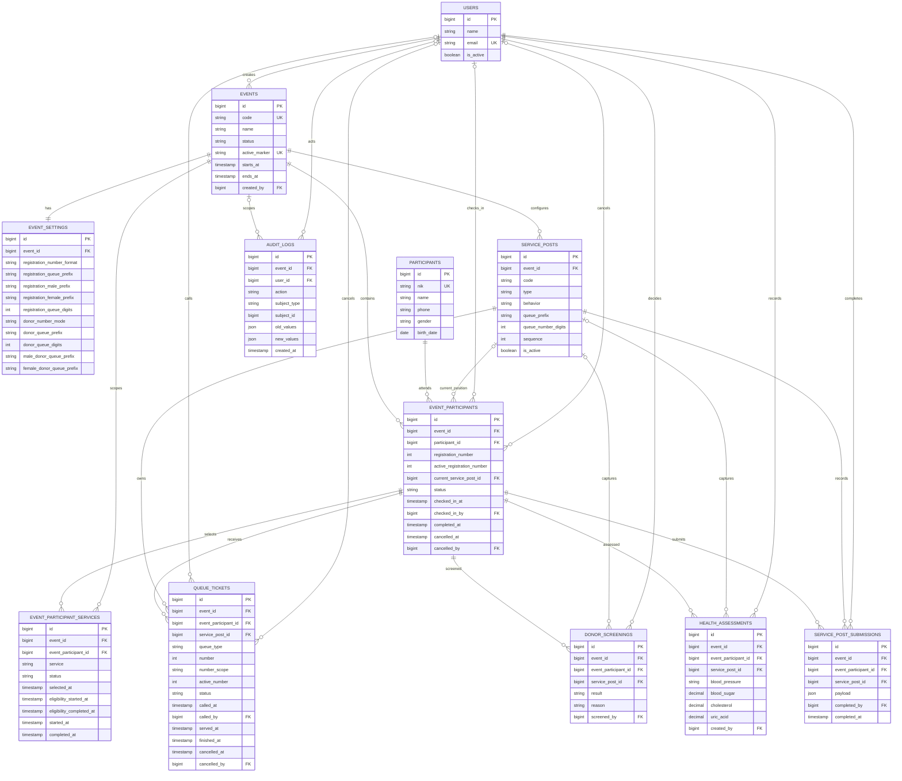
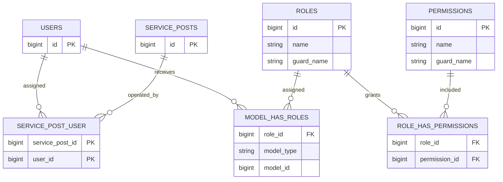

# ERD Final

ERD ini menggambarkan schema operasional setelah migration `2026_07_30_000028_make_participant_phone_optional.php`.

## Relasi operator dan permission

`audit_logs.subject_type` dan `subject_id` adalah relasi polymorphic. Karena itu relasi ke seluruh subject audit tidak digambar sebagai foreign key fisik.

## Constraint bisnis utama

- Satu event aktif dijaga oleh unique `events.active_marker`; event aktif memakai nilai `active`.
- Satu identitas peserta hanya boleh hadir satu kali per event: unique `(event_id, participant_id)`.
- Satu layanan hanya boleh dipilih satu kali per peserta event: unique `(event_participant_id, service)`.
- Satu peserta hanya memiliki satu tiket per pos: unique `(event_participant_id, service_post_id)`.
- Nomor registrasi aktif unik per event: unique `(event_id, active_registration_number)`.
- Nomor antrean aktif unik per scope: unique `(event_id, number_scope, active_number)`.
- Composite foreign key menjaga `event_id` pada peserta, layanan, pos, tiket, screening, dan pemeriksaan tetap berada dalam event yang sama.
- CHECK constraint menjaga nilai enum, rentang digit, timeline tiket, angka positif, dan konsistensi nomor historis dengan nomor aktif.
