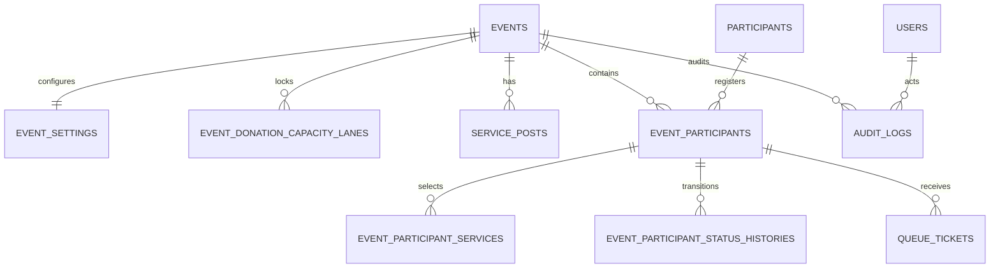

# ERD

`EVENT_SETTINGS` stores numbering configuration plus `donation_capacity_male` and `donation_capacity_female`, the independent maxima for `donating` participants. `EVENT_DONATION_CAPACITY_LANES` holds one lockable row for each event/gender and deliberately does not duplicate capacity values. The legacy `donation_capacity` field is retained only for compatibility. The status-history row stores `from_status`, `to_status`, `changed_by`, and `created_at`. Queue tickets preserve released numbers by nulling `active_number` instead of deleting history.
